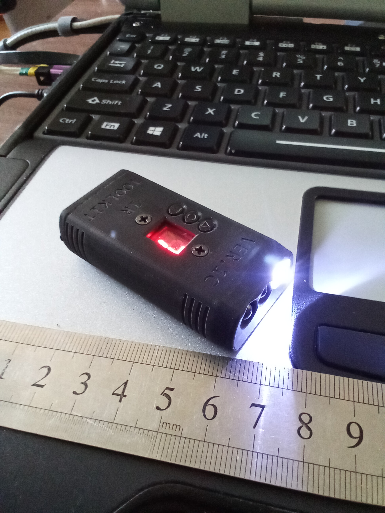
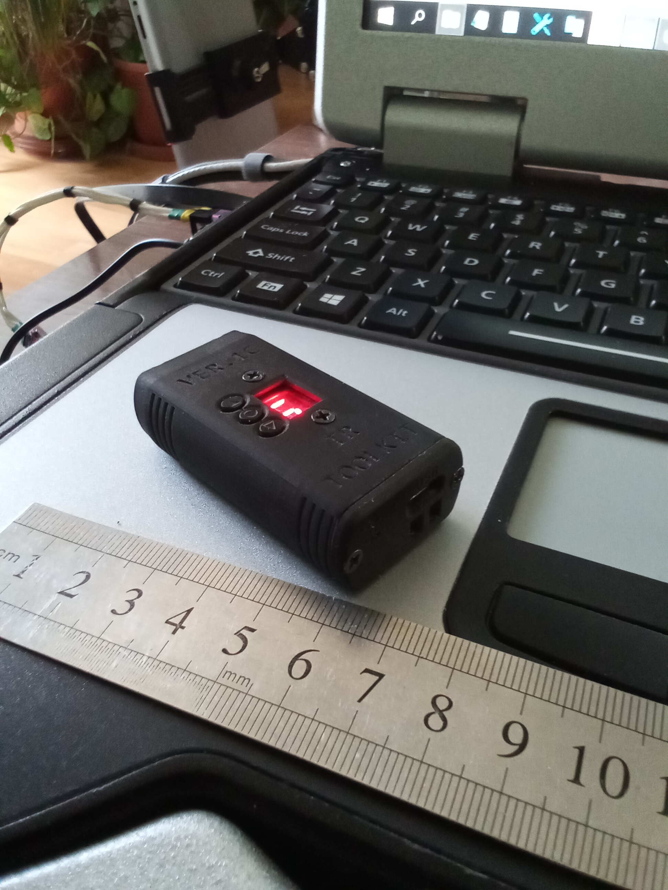
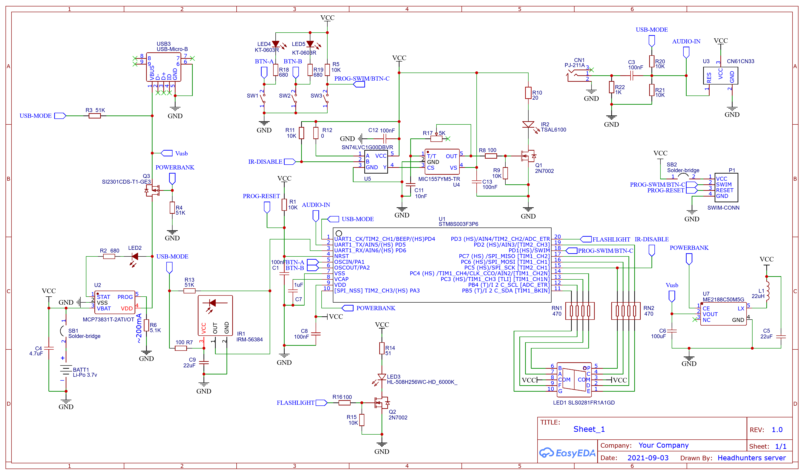
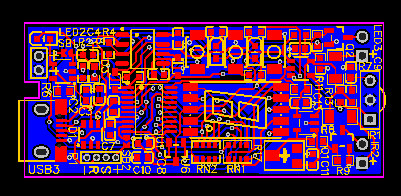
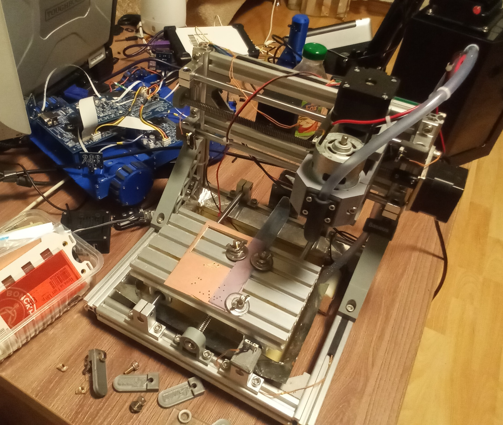

# IR-Toolkit: Карманный мультитул для работы с ИК-сигналами

**IR-Toolkit** — это миниатюрный мультитул-брелок, разработанный с нуля как хобби-проект. Устройство объединяет в себе функции фонарика, универсального ИК-пульта, инструмента для клонирования и анализа ИК-сигналов, а также портативного аккумулятора (power bank).

Весь цикл создания — от идеи и 3D-модели корпуса до проектирования печатной платы, написания прошивки и финальной сборки — выполнен самостоятельно.

## 🚀 Ключевые возможности

*   **Сверхъяркий фонарик:** Встроенный светодиод с номинальным током 100 мА.
*   **Универсальный ИК-пульт:** Возможность хранить и воспроизводить до 9 различных ИК-команд.
*   **Клонирование ИК-сигналов:** Запись и сохранение сигналов с любого ИК-пульта в энергонезависимую память.
*   **ИК-глушилка:** Режим, который "забивает" эфир помехами, временно блокируя работу ИК-приемников в помещении (телевизоры, кондиционеры и т.д.).
*   **Микро пауэрбанк:** Возможность отдать часть заряда для экстренной подзарядки других устройств через USB.
*   **Длительная автономность:** Потребление в режиме сна настолько низкое, что устройство может находиться в ожидании больше года на одном заряде.

## 🛠️ Технические характеристики

*   **Микроконтроллер:** STMicroelectronics `STM8S003F3P6`.
*   **Дисплей:** 7-сегментный светодиодный индикатор `SLS0281FR1A1GD`.
*   **Аккумулятор:** Li-Po 3.7В, 550 мАч (от мини-квадрокоптера).
*   **Зарядка:** Через Micro-USB, контроллер `MCP73831T-2ATI/OT`.
*   **ИК-излучатель:** `TSAL6100` (Vishay).
*   **ИК-приемник:** `IRM-56384` (Everlight).
*   **Корпус:** Разработан в КОМПАС-3D, напечатан на SLA 3D-принтере (Anycubic Photon Mono).

## ⚙️ Процесс разработки и производства

Этот проект — демонстрация полного цикла создания электронного устройства, от концепции до готового прототипа.

### 1. Проектирование электроники

Схема и печатная плата были разработаны в среде **EasyEDA**. В качестве "мозга" устройства был выбран микроконтроллер STM8S003F3P6 благодаря его относительно низкому энергопотреблению, доступности и малым размерам.

Платы заказывались на фабрике через сервис JLCPCB. И первая, и вторая ревизии (с функцией power bank) — двухслойные.

**Электрическая схема:**

**Топология печатной платы:**

### 2. Сборка и пайка

Первые прототипы собирались вручную. SMD-компоненты (вплоть до типоразмера 0603) паялись с помощью термофена и пинцета, а выводные компоненты (THT) — классическим паяльником.

Для второй ревизии плат была заказана партия с услугой PCBA (автоматизированный монтаж компонентов), что позволило получить платы фабричного качества.

### 3. Разработка корпуса и механика

Корпус был спроектирован в **КОМПАС-3D** с учетом эргономики и геометрии всех компонентов. Для изготовления использовался домашний SLA 3D-принтер **Anycubic Photon Mono**, что позволило добиться высокой детализации и отсутствия шероховатостей. После печати детали "закалялись" в УФ-камере для придания им прочности.

Особая деталь — защитное стеклышко для 7-сегментного индикатора. Оно было вырезано из акрила на модернизированном ЧПУ-станке с водяным охлаждением шпинделя, чтобы избежать оплавления материала.

### 4. Программное обеспечение

Прошивка написана на чистом **C** в среде **ST Visual Develop (STVD)** с использованием библиотеки **STM8S/A Standard Peripherals Library**.

Ключевые аспекты прошивки:
*   **Конечный автомат:** Управляет режимами работы устройства (экран блокировки, главное меню, фонарик, ИК-пульт и т.д.).
*   **Обработка прерываний:** Захват ИК-сигнала реализован через внешнее прерывание `EXTI` от ИК-приемника (задний фронт). Таймеры TIM1 и TIM2 используются для точного измерения длительности импульсов и пауз.
*   **Управление питанием:** Реализован режим `halt()` для сверхнизкого энергопотребления в режиме сна с пробуждением по нажатию кнопки.
*   **PWM для дисплея:** Яркость 7-сегментного индикатора регулируется с помощью ШИМ, реализованной на таймере, что позволяет экономить энергию при низком заряде батареи.

## 📂 Структура кода

*   `main.c`: Главный цикл программы, инициализация периферии, логика конечного автомата и обработка системных событий.
*   `display.c` / `display.h`: Драйвер для управления 7-сегментным индикатором. Включает в себя массив символов, функции для вывода строк с анимацией и управление яркостью.
*   `button.c` / `button.h`: Модуль для обработки нажатий кнопок с подавлением дребезга (debounce) и отслеживанием удержания.
*   `stm8s_it.c`: Файл с обработчиками прерываний (Interrupt Service Routines). Здесь находится логика для таймеров (обновление дисплея, системный тик) и внешних прерываний (захват ИК-сигнала).
*   `utils.c` / `utils.h`: Вспомогательные функции и макросы, определения пинов и портов.

## License
This project is licensed under the [CC BY-NC-ND 4.0](https://creativecommons.org/licenses/by-nc-nd/4.0/) license.
